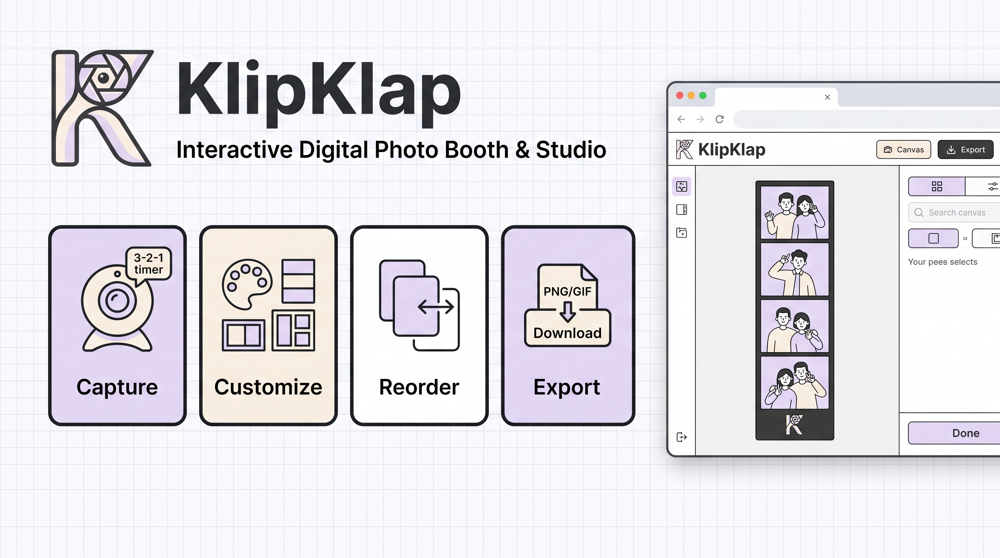

# KlipKlap

A browser-based photo booth application that replicates the Korean photo booth (photobooth) experience. Users capture a sequence of photos through their device camera, customize and style photo strips, and export them as high-quality static images, animated GIFs, or MP4 videos.

[Live Demo](https://klipklap-studio.vercel.app/)

---

## Key Features

- **Multi-shot capture sequence** — Automated countdown timer (3, 5, or 10 seconds) triggers sequential captures across user-defined pose counts.
- **Seven layout presets** — Classic Strip 1x4, Trio Strip 1x3, Duo Strip 1x2, Solo Polaroid 1x1, Studio Grid 2x2, Portrait Grid 2x3, and Mega Collage 3x3.
- **Filter presets** — Applies CSS-based image filters (grayscale, sepia, vivid, muted, etc.) to the composed strip in real time.
- **Frame and color customization** — Selectable frame color, border width, and slot calibration per layout.
- **Photo reordering** — Drag or swap individual captured frames within the strip before export.
- **Live Motion mode** — Animates captured frames as a looping sequence, exportable as GIF (suitable for WhatsApp, X/Twitter) or MP4 (suitable for Instagram, TikTok).
- **MP4 export** — Deterministic frame-by-frame encoding via the WebCodecs API (`VideoEncoder`) and `mp4-muxer`, producing a 24 FPS video with zero frame drops.
- **GIF export** — Frame-by-frame palette quantization via `gifenc`, producing a compact looping animation.
- **Static strip export** — Composites the final photo strip to a `<canvas>` element and downloads it as a PNG.
- **Camera controls** — Mirror toggle, front/rear camera switching (on supported devices), simulated camera mode for development.
- **Fully responsive layout** — Dedicated desktop (12-column grid) and mobile (single-column dock) interfaces, with no shared component coupling between breakpoints.
- **No server dependency** — All capture, composition, and encoding logic runs entirely in the browser. No data is uploaded.

---

## Technology Stack

| Category | Technology |
|---|---|
| Language | TypeScript 6 |
| UI Framework | React 19 |
| Build Tool | Vite 8 |
| Styling | Tailwind CSS 3 |
| State Management | Zustand 5 |
| GIF Encoding | gifenc 1.0 |
| MP4 Muxing | mp4-muxer 5.2 |
| Video Encoding | WebCodecs API (native browser) |
| Canvas Composition | HTML Canvas API (native browser) |
| Icons | lucide-react |
| Deployment | Vercel (SPA rewrite rules) |

---

## Project Structure

```
src/
  components/
    booth/          # Capture screen components (CameraView, ShutterControls, StripTray, MobileBoothDock)
    studio/         # Edit screen components (EditorCanvas, ExportSidebar, LayoutSelector, FramePicker, FilterPicker, PhotoReorderTray, MobileStudioEditor)
    common/         # Shared components (Header)
  hooks/
    useWebcam.ts    # Webcam lifecycle, frame capture, and video recording
  stores/
    useBoothStore.ts  # Global application state via Zustand
  utils/
    canvasComposer.ts  # Canvas composition, GIF encoding, and MP4 encoding logic
    constants.ts       # Layout configs, frame options, filter definitions
    audio.ts           # Shutter sound synthesis
  types/             # Shared TypeScript type definitions
```

---

## Application Flow

The system guides users through an intuitive 4-step workflow across two primary screens:

1. **Capture (`Klip!`)** — *Booth Screen (`currentStep === 'booth'`)`: Access device webcam (or simulated camera), select countdown interval (3s, 5s, 10s), and perform automated multi-shot photo sequences.
2. **Customize** — *Studio Screen (`currentStep === 'studio'`)`: Choose from 7 layout presets (1x4, 2x2, etc.), customize frame colors/spacing, and apply instant visual filters.
3. **Reorder** — *Studio Screen (`currentStep === 'studio'`)`: Swap and reposition captured frames across layout slots using drag or quick-swap interactions.
4. **Export (`Klap!`)** — *Studio Screen (`currentStep === 'studio'`)`: Render and download final outputs as static PNG photo strips, animated looping GIFs, or 24 FPS MP4 videos.

---

## Local Development

**Prerequisites:** Node.js 18 or later.

```bash
# Install dependencies
npm install

# Start the development server
npm run dev

# Type-check and build for production
npm run build
```

The development server runs at `http://localhost:5173` by default.

Camera access requires a secure context (`localhost` or `https`). The application includes a simulated camera mode that can be toggled from the camera view for development without a physical camera.

---

## Browser Requirements

| Feature | Minimum Support |
|---|---|
| WebCodecs API (`VideoEncoder`) | Chrome 94+, Edge 94+ |
| Canvas API | All modern browsers |
| MediaDevices (`getUserMedia`) | All modern browsers over HTTPS |

GIF export is available on all modern browsers. MP4 export via WebCodecs is limited to Chromium-based browsers. Firefox and Safari users should use the GIF export path.

---

## License

This project is private and not licensed for public redistribution.
